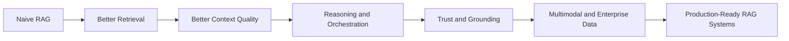
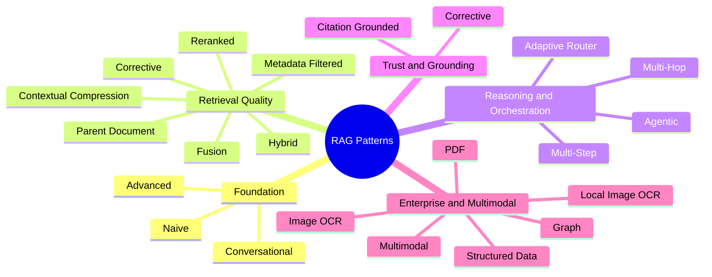
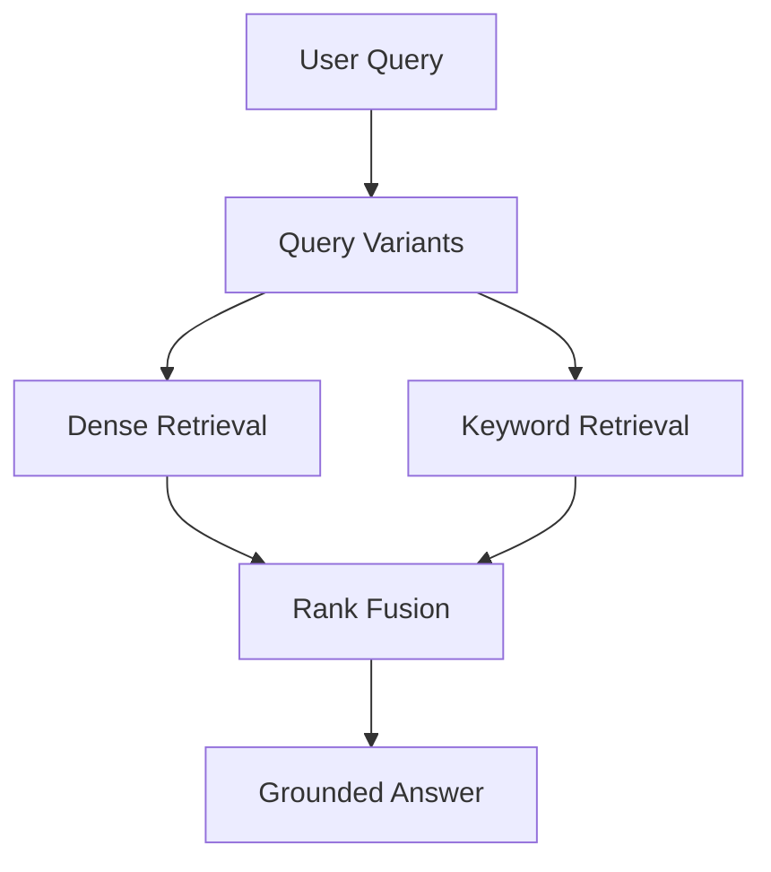
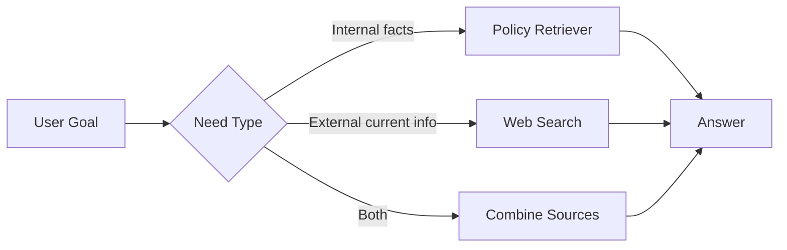
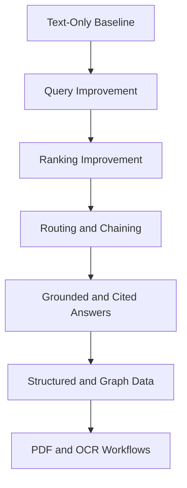

# The Ultimate Guide to RAG Patterns

If you only remember one thing about Retrieval-Augmented Generation, make it this: most RAG systems do not fail because the model is weak. They fail because retrieval is too shallow, too narrow, too brittle, or too disconnected from the shape of the real business question.

That is why "RAG" is not one pattern. It is a stack of patterns.

This guide walks through the full pattern set implemented in this repository, from the simplest vector lookup to multi-hop, graph-aware, multimodal, PDF, OCR, and adaptive routing systems. It is written for two audiences at once:

- Technical readers who want concrete implementation ideas.
- Business readers who want to understand when a more advanced RAG architecture actually changes product quality, trust, cost, or speed to value.

This guide is complete for the codebase in this repository. Every implemented pattern is covered, categorized, and linked directly to its example code.

Repository: [rag-evolution-patterns](https://github.com/eagleeyethinker/rag-evolution-patterns)

## Why RAG Patterns Matter

Basic RAG answers one question well: "Can I pull semantically similar text and ask an LLM to answer from it?"

Real products need to answer harder questions:

- What if the user asks with the wrong words?
- What if the answer lives across multiple documents?
- What if the data is a table, a graph, a PDF, or an image?
- What if the system should cite sources?
- What if retrieval should adapt based on the query?
- What if a bad first retrieval needs repair?

That is where patterns come in.

For technical teams, patterns reduce hallucinations, improve recall, and make retrieval architectures composable.

For business teams, patterns turn "AI demo quality" into "AI product quality." Better retrieval means fewer wrong answers, better customer trust, lower support load, faster employee enablement, and clearer ROI.

## The Five Categories of RAG Patterns

The 21 examples in this repo fit into five practical categories:

1. Foundation patterns: the starting point for semantic retrieval.
2. Retrieval quality patterns: techniques that improve recall and ranking.
3. Reasoning and orchestration patterns: techniques that break, route, or chain work.
4. Trust and grounding patterns: techniques that make answers safer and easier to verify.
5. Enterprise and multimodal patterns: techniques for structured, graph, PDF, and image-heavy environments.

## Category 1: Foundation Patterns

These patterns get a RAG system off the ground. They are the fastest way to move from "LLM with no memory" to "LLM grounded on enterprise knowledge."

### 1. Naive RAG

Code: [01_naive_rag](https://github.com/eagleeyethinker/rag-evolution-patterns/tree/main/01_naive_rag)

What it is:
A vector search over chunked text, followed by answer generation from the retrieved context.

What the code does:
The example splits the company handbook into sections, embeds them into Chroma, retrieves the top matches, and asks `gpt-4o-mini` to answer only from those sections.

Why it matters:
This is the baseline every team should start with. It is simple, cheap, and fast to implement.

Business value:
Great for internal knowledge assistants, lightweight policy search, and early prototypes where speed matters more than edge-case coverage.

Limitation:
If the user asks with unfamiliar wording, spans multiple facts, or needs structured reasoning, naive RAG starts to crack.

### 2. Advanced RAG

Code: [02_advanced_rag](https://github.com/eagleeyethinker/rag-evolution-patterns/tree/main/02_advanced_rag)

What it is:
Query expansion before retrieval.

What the code does:
It uses `MultiQueryRetriever` to generate multiple query variants from one user question and retrieves across those variations.

Why it matters:
Users rarely ask questions using the exact language found in documents. Multi-query retrieval raises recall without forcing users to "speak retrieval."

Business value:
Better first-answer success rates, fewer "I know this is documented somewhere" failures, and smoother onboarding experiences for employees and customers.

### 3. Conversational RAG

Code: [13_conversational_rag](https://github.com/eagleeyethinker/rag-evolution-patterns/tree/main/13_conversational_rag)

What it is:
History-aware query rewriting for follow-up questions.

What the code does:
It turns a follow-up like "What about the core hours for that policy?" into a standalone query using chat history, then retrieves against the rewritten version.

Why it matters:
Most real users do not ask perfectly self-contained questions. They ask like humans.

Business value:
This is essential for chat copilots, help desks, internal assistants, and customer support flows where context carries across multiple turns.

## Category 2: Retrieval Quality Patterns

These patterns improve what gets retrieved, how results are ranked, and how much noise reaches the model.

### 4. Hybrid RAG

Code: [05_hybrid_rag](https://github.com/eagleeyethinker/rag-evolution-patterns/tree/main/05_hybrid_rag)

What it is:
Dense retrieval plus keyword retrieval in one pipeline.

What the code does:
It combines semantic similarity from Chroma with a keyword overlap scorer, then merges the result sets.

Why it matters:
Embeddings are good at semantic closeness. Keywords are good at exact terms, acronyms, SKU-like strings, and compliance wording. Hybrid gives you both.

Business value:
Especially strong for enterprise search, policy search, product catalogs, legal text, and environments full of exact terminology.

### 5. Reranked RAG

Code: [06_reranked_rag](https://github.com/eagleeyethinker/rag-evolution-patterns/tree/main/06_reranked_rag)

What it is:
Retrieve broad first, then reorder candidates with a second scoring pass.

What the code does:
The demo pulls five candidates from vector search, scores them with a lightweight keyword-aware reranker, and answers from the reranked top set.

Why it matters:
Top-k retrieval is often "almost right." Reranking is how many strong production systems turn almost right into actually right.

Business value:
Higher precision means fewer misleading answers, less context waste, and better trust in high-traffic assistants.

### 6. Metadata-Filtered RAG

Code: [07_metadata_filtered_rag](https://github.com/eagleeyethinker/rag-evolution-patterns/tree/main/07_metadata_filtered_rag)

What it is:
Apply structured constraints before semantic search.

What the code does:
The example extracts query filters like department, region, and audience, narrows the search pool, then performs semantic retrieval inside that smaller set.

Why it matters:
Not every question should search everything. Metadata filters reduce noise and prevent retrieving irrelevant but semantically similar content.

Business value:
Critical for role-based policy search, regional compliance, multi-tenant knowledge systems, and large enterprise knowledge bases.

### 7. Parent Document RAG

Code: [08_parent_document_rag](https://github.com/eagleeyethinker/rag-evolution-patterns/tree/main/08_parent_document_rag)

What it is:
Retrieve with small child chunks, answer with larger parent sections.

What the code does:
It indexes fine-grained child lines for precision, then expands hits back into full parent sections for richer answering context.

Why it matters:
Small chunks improve match quality. Big chunks improve answer completeness. Parent-child retrieval gives you both.

Business value:
Useful for employee handbooks, long playbooks, manuals, and documentation where the answer often needs surrounding rules and nuance.

### 8. Contextual Compression RAG

Code: [09_contextual_compression_rag](https://github.com/eagleeyethinker/rag-evolution-patterns/tree/main/09_contextual_compression_rag)

What it is:
Shrink retrieved documents down to only the lines that matter.

What the code does:
Each retrieved document is compressed by the LLM into question-relevant lines before final answer generation.

Why it matters:
Good retrieval can still send too much irrelevant text to the model. Compression reduces token waste and sharpens answers.

Business value:
Helps with cost control, latency, and answer clarity, especially when source documents are verbose.

### 9. Corrective RAG

Code: [10_corrective_rag](https://github.com/eagleeyethinker/rag-evolution-patterns/tree/main/10_corrective_rag)

What it is:
Detect weak retrieval and retry with a better query.

What the code does:
The demo scores the first retrieval pass, rewrites the query when quality looks weak, and retrieves again before answering.

Why it matters:
Some user questions are poorly phrased for retrieval. Corrective loops let the system recover instead of failing silently.

Business value:
This can materially improve answer quality in self-service experiences, where there is no human librarian to rephrase the question.

### 10. Fusion RAG

Code: [17_fusion_rag](https://github.com/eagleeyethinker/rag-evolution-patterns/tree/main/17_fusion_rag)

What it is:
Combine rankings from multiple retrievers and query variants.

What the code does:
The example generates several query variants, retrieves with both semantic and keyword methods, then merges rankings using reciprocal rank fusion.

Why it matters:
Fusion is one of the strongest patterns for improving recall and robustness without betting on a single retrieval strategy.

Business value:
Great for broad enterprise corpora where important answers may surface through different retrieval signals.

## Category 3: Reasoning and Orchestration Patterns

These patterns help when the problem is not just retrieval quality, but retrieval workflow.

### 11. Multi-Step RAG

Code: [03_multi_step_rag](https://github.com/eagleeyethinker/rag-evolution-patterns/tree/main/03_multi_step_rag)

What it is:
Break one complex question into simpler sub-questions.

What the code does:
The LLM decomposes the original question into two sub-questions, retrieves for each, then synthesizes a final answer.

Why it matters:
One large query can hide multiple intents. Multi-step retrieval prevents one part of the question from drowning out the other.

Business value:
Useful for compound business questions like policy plus budget, or status plus recommendation.

### 12. Multi-Hop RAG

Code: [18_multi_hop_rag](https://github.com/eagleeyethinker/rag-evolution-patterns/tree/main/18_multi_hop_rag)

What it is:
Retrieve or compute one fact, then use it to retrieve or compute the next.

What the code does:
The demo first identifies the stipend limit, then filters the equipment catalog against that budget, then chooses the desk with the longest warranty.

Why it matters:
Some answers are chains, not snippets. Multi-hop is how RAG systems answer questions whose second step depends on the first.

Business value:
Important for assistants that combine policy, pricing, eligibility, inventory, or workflow logic.

### 13. Adaptive Router RAG

Code: [15_adaptive_router_rag](https://github.com/eagleeyethinker/rag-evolution-patterns/tree/main/15_adaptive_router_rag)

What it is:
Choose the right retriever or corpus based on the query.

What the code does:
It routes between policy documents, equipment catalog data, or a combined path depending on what the user is asking.

Why it matters:
Not all questions should hit the same index. Routing improves accuracy and keeps retrieval focused.

Business value:
A major unlock for enterprise assistants spanning HR, IT, finance, operations, and product data.

### 14. Agentic RAG

Code: [04_agentic_rag](https://github.com/eagleeyethinker/rag-evolution-patterns/tree/main/04_agentic_rag)

What it is:
A tool-using agent decides which information source to consult.

What the code does:
The agent chooses between internal policy retrieval and web search, based on whether the task needs internal knowledge, current external knowledge, or both.

Why it matters:
This is the bridge from passive retrieval to action-oriented knowledge systems.

Business value:
Powerful for procurement assistants, support copilots, research assistants, and workflows that mix private data with live external information.

Tradeoff:
Agentic RAG is more flexible, but usually more expensive and harder to control than fixed pipelines.

## Category 4: Trust and Grounding Patterns

These patterns make answers easier to verify and safer to use in production.

### 15. Citation-Grounded RAG

Code: [14_citation_grounded_rag](https://github.com/eagleeyethinker/rag-evolution-patterns/tree/main/14_citation_grounded_rag)

What it is:
Answer with explicit source references.

What the code does:
It formats retrieved sections with visible labels and instructs the model to cite those labels exactly in the final answer.

Why it matters:
Users trust systems more when they can inspect the source. Reviewers move faster when evidence is attached.

Business value:
High-value for legal, compliance, audit, HR policy, finance, and executive reporting use cases.

### Corrective RAG as a Trust Pattern

Code: [10_corrective_rag](https://github.com/eagleeyethinker/rag-evolution-patterns/tree/main/10_corrective_rag)

Why it belongs here too:
Corrective RAG is not just a retrieval quality trick. It is also a trust pattern, because it reduces the chance that the system confidently answers from weak evidence.

Business value:
Less brittle self-service AI means fewer escalations and lower risk of confidently wrong answers.

## Category 5: Enterprise and Multimodal Patterns

This is where RAG becomes much more interesting for real companies. Enterprise knowledge is not only paragraphs in text files. It lives in tables, JSON records, graphs, PDFs, scanned images, receipts, contracts, and whiteboards.

### 16. Structured Data RAG

Code: [12_structured_data_rag](https://github.com/eagleeyethinker/rag-evolution-patterns/tree/main/12_structured_data_rag)

What it is:
Combine text retrieval with structured table reasoning.

What the code does:
The demo pulls policy text from the handbook, loads CSV product data from an equipment catalog, finds eligible standing desks under the stipend, and passes both unstructured and structured context into the answer stage.

Why it matters:
A huge percentage of business questions cross both policy and data.

Business value:
This is one of the highest-ROI patterns in the entire guide because many enterprise questions are exactly this shape: "What does policy allow, and which records satisfy it?"

### 17. Graph RAG

Code: [11_graph_rag](https://github.com/eagleeyethinker/rag-evolution-patterns/tree/main/11_graph_rag)

What it is:
Use graph relationships, not only chunk similarity.

What the code does:
The example loads nodes and edges from `company_graph.json`, finds matched nodes, expands across adjacent relationships, and builds answer context from graph facts.

Why it matters:
Some knowledge is relational by nature: dependencies, ownership, hierarchies, linked products, workflows, entities, and policies.

Business value:
Strong fit for knowledge graphs, supply chains, org structures, product dependency maps, and connected enterprise records.

### 18. Multimodal RAG

Code: [16_multimodal_rag](https://github.com/eagleeyethinker/rag-evolution-patterns/tree/main/16_multimodal_rag)

What it is:
Retrieve over text extracted from multiple modalities like slides, images, diagrams, and tables.

What the code does:
It loads multimodal records from JSON, embeds their textual representations, retrieves the most relevant items, and answers from that mixed-modality context.

Why it matters:
A lot of operational knowledge is trapped in presentations, screenshots, whiteboards, and visual artifacts.

Business value:
This pattern expands searchable knowledge coverage without requiring every source to start as clean prose.

### 19. PDF RAG

Code: [19_pdf_rag](https://github.com/eagleeyethinker/rag-evolution-patterns/tree/main/19_pdf_rag)

What it is:
Retrieve and answer directly from PDF pages.

What the code does:
It loads realistic invoice and tax-form PDFs with `PyPDFLoader`, indexes the pages, retrieves relevant ones, and cites page-level labels in the answer.

Why it matters:
PDF is still one of the dominant business document formats.

Business value:
Useful for finance ops, procurement, tax workflows, contract review, invoice support, and document-heavy back-office automation.

### 20. Image OCR RAG

Code: [20_image_ocr_rag](https://github.com/eagleeyethinker/rag-evolution-patterns/tree/main/20_image_ocr_rag)

What it is:
Retrieve over OCR text that has already been extracted from images.

What the code does:
The example loads OCR output linked to enterprise images, indexes the extracted text, and answers questions while pointing back to the source image.

Why it matters:
Many business facts live in receipts, invoices, scans, and photos, not in clean text.

Business value:
Important for finance, operations, compliance, expense automation, and document intake systems.

### 21. Local Image OCR RAG

Code: [21_local_image_ocr_rag](https://github.com/eagleeyethinker/rag-evolution-patterns/tree/main/21_local_image_ocr_rag)

What it is:
Run OCR locally at retrieval time, then index and retrieve over the extracted text.

What the code does:
It uses `RapidOCR` to process local images, converts OCR lines into retrievable documents, and answers grounded only in runtime-local extraction.

Why it matters:
This pattern is useful when OCR cannot be fully precomputed or when teams want local processing behavior.

Business value:
Attractive for privacy-sensitive or edge workflows where document ingestion happens close to the source.

## The Fastest Way to Understand the Evolution

If you want the shortest practical map, think of the progression like this:

- `01` to `03`: make retrieval work.
- `04` to `10`: make retrieval smarter and more resilient.
- `11` to `18`: make retrieval handle richer structure and multi-stage reasoning.
- `19` to `21`: make retrieval work on real business documents and images.

## Which Pattern Should You Use First?

For technical teams:

- Start with `01_naive_rag` to establish the baseline.
- Add `05_hybrid_rag` or `02_advanced_rag` when recall is weak.
- Add `06_reranked_rag` when retrieved results are close but not reliably right.
- Add `14_citation_grounded_rag` when trust matters.
- Add `15_adaptive_router_rag`, `12_structured_data_rag`, or `18_multi_hop_rag` when questions cross systems.

For business teams:

- Use naive or hybrid RAG for fast internal knowledge wins.
- Use citation-grounded RAG when answers influence decisions, compliance, or money.
- Use structured, PDF, and OCR patterns when the real source of truth is not plain text.
- Use routing and multi-hop patterns when the assistant must combine policies with records, products, or workflows.

## A Practical Maturity Model

Here is the simplest maturity ladder for most teams:

1. Baseline: `01_naive_rag`
2. Better recall: `02_advanced_rag` or `05_hybrid_rag`
3. Better precision: `06_reranked_rag`
4. Better trust: `14_citation_grounded_rag` and `10_corrective_rag`
5. Better workflow fit: `03_multi_step_rag`, `15_adaptive_router_rag`, `18_multi_hop_rag`
6. Better enterprise coverage: `12_structured_data_rag`, `11_graph_rag`, `19_pdf_rag`, `20_image_ocr_rag`, `21_local_image_ocr_rag`

This is also the path most teams follow in real life: not from simple to "fancy," but from simple to "fit for the shape of the problem."

## Final Take

The biggest mistake in RAG is treating it like a single architecture.

RAG is a design space.

Some problems need better recall. Some need routing. Some need structured joins. Some need citations. Some need graph traversal. Some need OCR. The strongest systems combine several of these patterns instead of arguing about one "best" RAG design.

If you want to study the evolution hands-on, work through the repository in order:

- [01_naive_rag](https://github.com/eagleeyethinker/rag-evolution-patterns/tree/main/01_naive_rag)
- [02_advanced_rag](https://github.com/eagleeyethinker/rag-evolution-patterns/tree/main/02_advanced_rag)
- [03_multi_step_rag](https://github.com/eagleeyethinker/rag-evolution-patterns/tree/main/03_multi_step_rag)
- [04_agentic_rag](https://github.com/eagleeyethinker/rag-evolution-patterns/tree/main/04_agentic_rag)
- [05_hybrid_rag](https://github.com/eagleeyethinker/rag-evolution-patterns/tree/main/05_hybrid_rag)
- [06_reranked_rag](https://github.com/eagleeyethinker/rag-evolution-patterns/tree/main/06_reranked_rag)
- [07_metadata_filtered_rag](https://github.com/eagleeyethinker/rag-evolution-patterns/tree/main/07_metadata_filtered_rag)
- [08_parent_document_rag](https://github.com/eagleeyethinker/rag-evolution-patterns/tree/main/08_parent_document_rag)
- [09_contextual_compression_rag](https://github.com/eagleeyethinker/rag-evolution-patterns/tree/main/09_contextual_compression_rag)
- [10_corrective_rag](https://github.com/eagleeyethinker/rag-evolution-patterns/tree/main/10_corrective_rag)
- [11_graph_rag](https://github.com/eagleeyethinker/rag-evolution-patterns/tree/main/11_graph_rag)
- [12_structured_data_rag](https://github.com/eagleeyethinker/rag-evolution-patterns/tree/main/12_structured_data_rag)
- [13_conversational_rag](https://github.com/eagleeyethinker/rag-evolution-patterns/tree/main/13_conversational_rag)
- [14_citation_grounded_rag](https://github.com/eagleeyethinker/rag-evolution-patterns/tree/main/14_citation_grounded_rag)
- [15_adaptive_router_rag](https://github.com/eagleeyethinker/rag-evolution-patterns/tree/main/15_adaptive_router_rag)
- [16_multimodal_rag](https://github.com/eagleeyethinker/rag-evolution-patterns/tree/main/16_multimodal_rag)
- [17_fusion_rag](https://github.com/eagleeyethinker/rag-evolution-patterns/tree/main/17_fusion_rag)
- [18_multi_hop_rag](https://github.com/eagleeyethinker/rag-evolution-patterns/tree/main/18_multi_hop_rag)
- [19_pdf_rag](https://github.com/eagleeyethinker/rag-evolution-patterns/tree/main/19_pdf_rag)
- [20_image_ocr_rag](https://github.com/eagleeyethinker/rag-evolution-patterns/tree/main/20_image_ocr_rag)
- [21_local_image_ocr_rag](https://github.com/eagleeyethinker/rag-evolution-patterns/tree/main/21_local_image_ocr_rag)

That sequence is not just a tutorial path. It is the shortest route from "we have an LLM" to "we have an AI system that can actually operate on business knowledge."
